# Project introduction

This project analyzes a dataset about data-related job postings in the U.S., scraped by [Luke Barousse](https://www.kaggle.com/datasets/lukebarousse/data-analyst-job-postings-google-search) on Google Search. The focus of the project is specifically on data analyst job postings from 2023 to 2024. The goal of the project is to uncover insights into pay, skills, market trends, platforms, and locations to help new graduates or individuals interested in the analytics field with their job search journey. 

For the project, I utilized the following tools:
- **PostgreSQL:** For cleaning, managing, and querying necessary data about the job postings.
- **Excel:** For visualizing the data from each analysis.
- **Lucidspark:** For designing the entity relationship diagram (ERD).

# Importing data

Table schema:

```sql
CREATE TABLE postings  
(  
    posting_id TEXT,  
    index TEXT,  
    title TEXT,  
    company_name TEXT,  
    location TEXT,  
    via TEXT,  
    description TEXT,  
    extensions TEXT,  
    job_id TEXT,  
    thumbnail TEXT,  
    posted_at TEXT,  
    schedule_type TEXT,  
    work_from_home TEXT,  
    salary TEXT,  
    search_term TEXT,  
    date_time TEXT,  
    search_location TEXT,  
    commute_time TEXT,  
    salary_pay TEXT,  
    salary_rate TEXT,  
    salary_avg TEXT,  
    salary_min TEXT,  
    salary_max TEXT,  
    salary_hourly TEXT,  
    salary_yearly TEXT,  
    salary_standardized TEXT,  
    description_tokens TEXT  
);
```

All the columns are set to text type because of inconsistent formatting of the rows. Once the cleaning is completed, the columns' types will be adjusted accordingly.

# Data Cleaning

To maintain the original table, a copy was created for cleaning purposes:

```sql
CREATE TABLE postings_copy AS  
SELECT *  
FROM postings;
```

The columns that are irrelevant to the analysis are deleted, sample table for analysis:

```sql
SELECT *  
FROM postings_copy  
LIMIT 5;
```

| posting\_id | title | company\_name | location | via | schedule\_type | work\_from\_home | date\_time | salary\_standardized | description\_tokens |
| :--- | :--- | :--- | :--- | :--- | :--- | :--- | :--- | :--- | :--- |
| 1 | Senior Research/Data Analyst | State of Missouri | Jefferson City, MO | via Indeed | Full-time | false | 2023-08-17 03:00:13.426094 | 68516.5 | \['spreadsheet', 'word'\] |
| 2 | Marketing Data Analyst | Acadia Technologies, Inc. | Oklahoma City, OK | via Dice | Full-time | false | 2023-08-17 03:00:13.426094 | 70000.0 | \['sql'\] |
| 3 | Data Analyst II | Chickasaw Nation Industries | Norman, OK | via Ladders | Full-time | false | 2023-08-17 03:00:13.426094 | 125000.0 | \['html', 'pl/sql', 'power\_bi', 'java', 'power\_bi', 'sharepoint', 'sql'\] |
| 4 | Business Data Analyst | Eliassen Group | Anywhere | via LinkedIn | Full-time | True | 2023-08-17 03:00:18.518689 | 96500.0 | \['sql', 'sap'\] |
| 5 | \(USA\) Senior Data Analyst - Data Triage | Walmart | Bentonville, AR | via Ladders | Full-time | false | 2023-08-17 03:00:23.468605 | 100000.0 | \['looker', 'python', 'crystal', 'power\_bi', 'r', 'scala', 'spark', 'tableau', 'sql'\] |


### Handling missing values

- `work_from_home` column
Since the job description for the null rows does not mention working from home, we could assume that it is not an option and set their values to `FALSE`.

```sql
UPDATE postings_copy  
SET work_from_home = FALSE  
WHERE work_from_home IS NULL;
```

- `salary` column
Because salary is an important part of the analysis, all job postings without a salary range will be removed.

```sql
DELETE  
FROM postings_copy  
WHERE salary IS NULL;
```

- `location` column:
There are 4 rows in this column that do not specify a location. Since the location of 'Anywhere' is the mode of this column with over 4000 occurrences, I decided to fill these rows with it.

```sql
UPDATE postings_copy 
SET location = 'Anywhere'  
WHERE location IS NULL;
```

### Reformatting

Column `description` contains many line break characters so I cleaned it with this query:

```sql
UPDATE postings_copy  
SET description = REGEXP_REPLACE(description, '[\n\r]+', ' ', 'g');
```

Column `title` contains unnecessary information about the job titles, so description about location, schedule, or level needed to be removed. A new column named `job_main` is created to store the new names. The jobs titles are grouped into certain categories after skimming through the data.

```sql
ALTER TABLE postings_copy
ADD COLUMN job_main TEXT;

UPDATE postings_copy  
SET job_main =  
        CASE  
            WHEN title ~* 'Data Architect|Architect|Architecture|Warehouse'  
                THEN 'Data Architect'  
            WHEN title ~* 'Data quality|Quality assurance|Quality'  
                THEN 'Data Quality Assurance Analyst'  
            WHEN title ~* 'Visualization Analyst|Data viz|Visualization Specialist'  
                THEN 'Data Visualization Analyst'  
            WHEN title ~* 'Analytics Manager'  
                THEN 'Data Analytics Manager'  
            WHEN title ~* 'Business Analyst|BA|Business Analysis'  
                THEN 'Business Analyst'  
            WHEN title ~* 'Data Science|Scientist|Science'  
                THEN 'Data Scientist'  
            WHEN title ~* 'Data Engineer|Engineer|Data Engineering'  
                THEN 'Data Engineer'  
            WHEN title ~* 'Machine Learning Engineer|Machine Learning|ML Engineer|ML' 
                THEN 'Machine Learning Engineer'  
            WHEN title ~* 'Power BI|PBI|Tableau|Looker|Intelligence|Business Intelligence|BI'  
                THEN 'Business Intelligence Analyst'  
            WHEN title ~* 'Systems Analyst|Systems Analytics'  
                THEN 'Business Systems Analyst'  
            WHEN title ~* 'Finance|Financial|Quantitative|Quant|Stock'  
                THEN 'Financial Data Analyst'  
            WHEN title ~* 'Consultant|Consult|Consulting|Analytics Consultant'  
                THEN 'Analytics Consultant'  
            WHEN title ~* 'Programmer|Coder'  
                THEN 'Software Engineer'  
            ELSE 'Data Analyst'  
        END;
```

Next, a new column `job_level` is created to extract job levels from the `title` column

```sql
ALTER TABLE postings_copy  
    ADD COLUMN job_level TEXT;

UPDATE postings_copy 
SET job_level =  
        CASE  
            WHEN title ~* 'Intern|Co-Op|Coop|Internship' THEN 'Intern'  
            WHEN title ~* 'Sr.|Sr|Senior' THEN 'Senior'  
            WHEN title ~* 'Entry Level|Entry-Level' THEN 'Entry-Level'  
            WHEN title ~* 'Junior' THEN 'Junior'  
            WHEN title ~* 'Associate' THEN 'Associate'  
            WHEN title ~* 'Lead' THEN 'Lead'  
            WHEN title ~* 'Principal' THEN 'Principal'  
            WHEN title ~* 'Manager' THEN 'Manager'  
            WHEN title ~* 'Director' THEN 'Director'  
            WHEN title ~* 'Vice President|VP' THEN 'Vice President'  
            WHEN title LIKE ' I ' THEN 'I'  
            WHEN title LIKE ' II ' THEN 'II'  
            WHEN title LIKE ' III ' THEN 'III'  
        END;
```

The `via` column contains the platforms the job postings were published on but its name is very ambiguous. Moreover, many of the platform names have an unnecessary 'via' prefix so they need to be removed.

```sql
--Renaming
ALTER TABLE postings_copy  
    RENAME COLUMN via TO platform;

--Removing 'via' prefix
UPDATE postings_copy  
SET platform = remove_via.platform  
FROM (  
     SELECT posting_id, REGEXP_REPLACE(platform, 'via (.+)', '\1') AS platform  
     FROM postings_copy) remove_via  
WHERE postings_copy.posting_id = remove_via.posting_id;
```

### Changing data types

This step will convert the columns to their appropriate data types.

```sql
--work_from_home and date_time columns
ALTER TABLE postings_copy  
    ALTER COLUMN work_from_home TYPE boolean  
        USING work_from_home::boolean
	ALTER COLUMN date_time TYPE timestamp  
	    USING date_time::timestamp
	ALTER COLUMN salary_standardized TYPE numeric  
	    USING salary_standardized::numeric
	ALTER COLUMN description_tokens TYPE text[]  
        USING REGEXP_REPLACE(description_tokens, '\[(.+)\]', '{\1}')::text[]
```


# Data Normalization

In this step, the main table will be divided into smaller lookup (dimension) tables to follow the basic normalization forms of a relational database.

After normalization, the structure includes one fact table `job_postings` and five dimension tables `platform`, `company`, `job`, `location`, and `skill`. Each table stores information about different aspects of the job postings, such as companies, jobs, and platforms. 

With the `skill` table, because one job posting can require multiple skills and one skill can appear many times in the fact table, this is a many-to-many relationship. The `postings_skill` table is used as a bridge table to handle the records of this relationship.

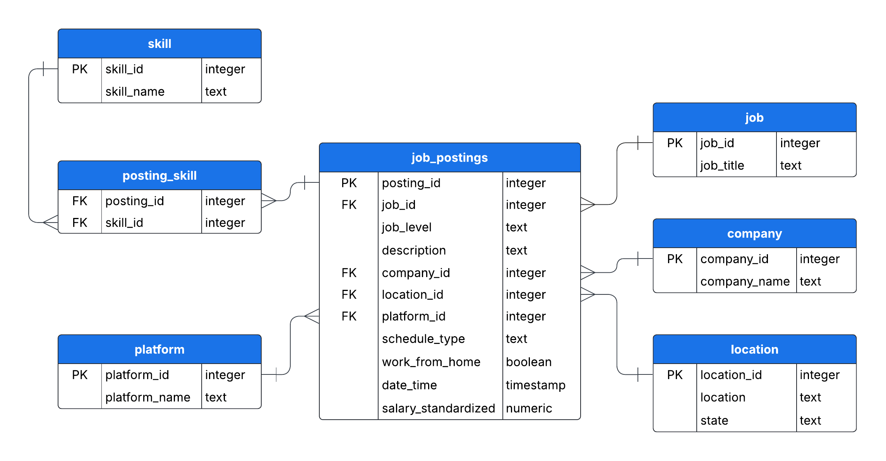

# Analysis

## 1. Salary

### Salary distribution

In order to understand how the salaries of data analyst jobs were distributed, the range will be divided into 7 equal-length bins for granularity.

```sql
--Finding bin length
SELECT ROUND((MAX(salary_standardized) - MIN(salary_standardized)) / 7, 0)  
FROM job_postings JOIN job  
    USING (job_id)  
WHERE job_title = 'Data Analyst';

--Dividing the bins
WITH salary_range  
AS (  
    SELECT salary_standardized AS salary,  
           CASE  
               WHEN salary_standardized BETWEEN 15080 AND 102069 THEN '$15,080 - $102,069'  
               WHEN salary_standardized BETWEEN 102070 AND 189058 THEN '$102,070 - $189,058'  
               WHEN salary_standardized BETWEEN 189059 AND 276047 THEN '$189,059 - $276,047'  
               WHEN salary_standardized BETWEEN 276048 AND 363036 THEN '$276,048 - $363,036'  
               WHEN salary_standardized BETWEEN 363037 AND 450025 THEN '$363,037 - $450,025'  
               WHEN salary_standardized BETWEEN 450026 AND 537014 THEN '$450,026 - $537,014'  
               WHEN salary_standardized BETWEEN 537015 AND 624000 THEN '$537,015 - $624,000'  
           END AS range  
    FROM job_postings JOIN job  
        USING (job_id)  
    WHERE job_title = 'Data Analyst'  
)  
  
SELECT range,  
       COUNT(*)  
FROM salary_range  
GROUP BY range;
```

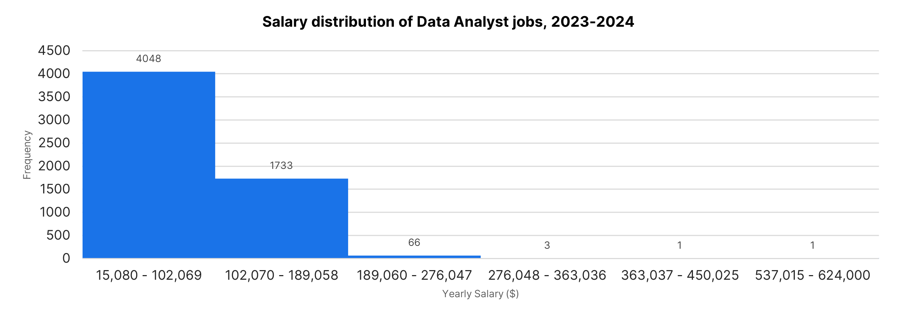

The most popular salary group for data analyst jobs was $15,000 to $102,069, which coincides with the average annual wage for US employees in 2023 of [$81,359](https://www.statista.com/statistics/243842/annual-mean-wages-and-salary-per-employee-in-the-us/). The higher salary group up to $189,000/year accounted for nearly 30% of the current jobs, showing there was much growth regarding pay for data analyst jobs. 

The extreme salaries which went up to $624,000/year likely represented outliers and could consist of higher roles such as Directors or high-level Managers. 

### Salary trend

Tracking the median salary by month in 2023 and 2024 of data analyst jobs to see how the pay varied throughout the year.

```sql
SELECT DISTINCT EXTRACT(YEAR FROM date_time) AS year,  
                EXTRACT(MONTH FROM date_time) AS month,  
                ROUND(PERCENTILE_CONT(0.5) WITHIN GROUP (ORDER BY salary_standardized )::numeric, 2) AS median_sal  
FROM job_postings JOIN job  
    USING (job_id)  
WHERE job_title = 'Data Analyst'  
  AND EXTRACT(YEAR FROM date_time) IN (2023, 2024)  
GROUP BY year, month  
ORDER BY year, month;
```

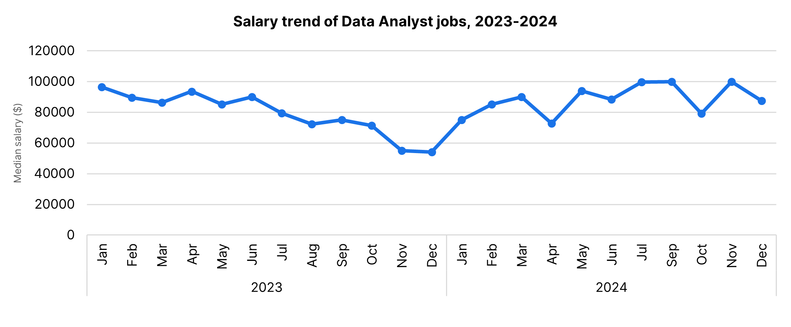

In general, the median salary of data analyst jobs had a downward trend in 2023, from around $96,500 in January to $54,000 at the end of the year. Salaries started to rebound in 2024, especially in the first three months, before slowly reaching its peak in November at $100,000.

The fall in median salary starting from July 2023 could reflect a pause in hiring or budget cuts from companies at the time and started to bounce back in 2024 with new budgets or a new hiring wave.

## 2. Skill

### Most demanded skills

I want to check which skills or tools are mentioned the most among the 7,290 postings available in the dataset. 
This could be done by creating a CTE to filter out all records from the `job_postings` table for data analyst jobs in year 2023 and 2024. Then, to count each skill's frequency, I joined the `job_postings` table with `posting_skill` and then with `skill`.

```sql
WITH da AS (  
           SELECT *  
           FROM job_postings JOIN job  
               USING (job_id)  
           WHERE job_title = 'Data Analyst'  
             AND EXTRACT(YEAR FROM date_time) IN (2023, 2024)  
           ORDER BY posting_id)  
  
SELECT skill_name,  
       COUNT(*) AS count  
FROM da JOIN posting_skill  
    USING (posting_id) JOIN skill  
    USING (skill_id)  
GROUP BY skill_name  
ORDER BY count DESC  
LIMIT 10;
```

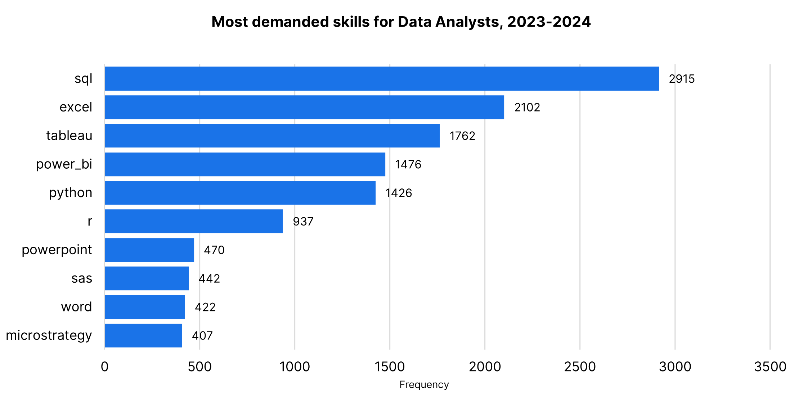

Looking at the top 10 most popular skills required for Data Analysts, we can see there are 4 main groups:
- **Database management:** SQL
- **Office tools:** Word, PowerPoint, Excel
- **Business Intelligence:** Tableau, Power BI, MicroStrategy, SAS
- **Programming:** Python, R

SQL was the most demanded skills with over 2,915 mentions among 7,290 postings, which is 40% of the total. Excel and business intelligence tools, specifically Power BI and Tableau, also showed strong demand from recruiters. 
Programming languages such as Python and R were also an important part of data analyst jobs, but their demand was much lower, suggesting they were often preferred instead of required as others.

### Skills trending

With the total number of mentions by skill, I want to find out how they fared over time in 2023 and 2024 by tracking the changes of the top 5 skills by month. 

```sql
WITH da AS (  
           SELECT *  
           FROM job_postings JOIN job  
               USING (job_id)  
           WHERE job_title = 'Data Analyst'  
             AND EXTRACT(YEAR FROM date_time) IN (2023, 2024)  
           ORDER BY posting_id)  
  
SELECT EXTRACT(YEAR FROM date_time) AS year,  
       EXTRACT(MONTH FROM date_time) AS month,  
       COUNT(*) FILTER (WHERE skill_name = 'sql') AS sql,  
       COUNT(*) FILTER (WHERE skill_name = 'excel') AS excel,  
       COUNT(*) FILTER (WHERE skill_name = 'tableau') AS tableau,  
       COUNT(*) FILTER (WHERE skill_name = 'power_bi') AS power_bi,  
       COUNT(*) FILTER (WHERE skill_name = 'python') AS python  
FROM da JOIN posting_skill  
    USING (posting_id) JOIN skill  
    USING (skill_id)  
GROUP BY year, month  
ORDER BY year, month;
```

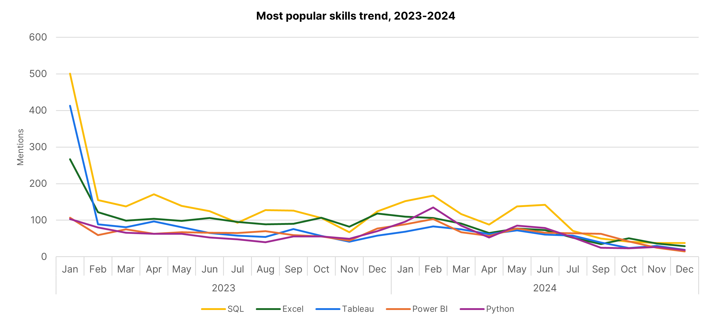

Overall there was a declining trend in both 2023 and 2024 with two notable peaks in January 2023 and February 2024. This pattern matches that of the hiring trend in these two years. 

SQL remained the most in-demand skill, peaking at 501 mentions in January 2023 and decreased steadily for the rest of the year. It picked up the momentum slowly in the first two months of 2024, but still showed a declining trend with some fluctuations until the end of 2024 at only 38. 

Excel was consistently the second in-demand skill throughout 2023 with relatively stable numbers in the second and third quarter of 2023. On the contrary, it showed a continuous falling trend in 2024 to only 29 mentions by December.

Likewise, Tableau started strong in January 2023 and began its downward trend throughout the two years to 19 mentions by December 2024.

Power BI and Python did not start out as strong as other skills, with only 107 and 103 mentions. However, their trajectories followed a similar pattern, with a small increase at the beginning of 2024 and started falling to only 15 and 18 mentions by December.

### Salary by skill

Knowing the most popular skills, I want to find out which required skills were the most valuable by calculating the median salary grouped by skill.

```sql
WITH da AS (  
           SELECT *  
           FROM job_postings JOIN job  
               USING (job_id)  
           WHERE job_title = 'Data Analyst'  
             AND EXTRACT(YEAR FROM date_time) IN (2023, 2024)  
           ORDER BY posting_id)  
  
SELECT skill_name,  
       PERCENTILE_CONT(0.5) WITHIN GROUP (ORDER BY salary_standardized) AS median_sal 
FROM da JOIN posting_skill  
    USING (posting_id) JOIN skill  
    USING (skill_id)  
GROUP BY skill_name  
ORDER BY median_sal DESC  
LIMIT 10;
```

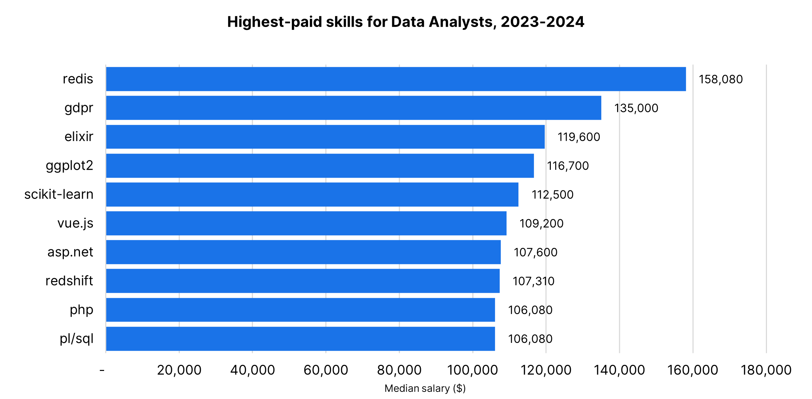

For the highest-paying skills in the result, we can categorize them as following:
- **Cloud infrastructure and big data:** Redis, Redshift, pl/sql
- **Software development:** Elixir, PHP
- **Web development:** vue.js, asp.net
- **Analytics tools:** ggplot2, scikit-learn 
- **Legal:** GDPR (General Data Protection Regulation) - a regulation in EU law addressing data protection and privacy.

Among the 10 highest-paid skills, 7 fall into software development and data/cloud engineering. This shows great potential in positions of big data and machine learning as companies are valuing data processing and development more. 

The lowest median salary on this list exceeded the most popular salary range from previous analysis ($102,069), meaning companies are willing to pay great salaries for these specialized positions. Therefore, data analysts that are aiming for higher compensation could look into specializing in these niche tools and programming languages (Redis, Elixir, etc.).

### Skill count vs. Salary

Since each job requires its own skill set, I want to find out whether there was a correlation between the number of skills required in a job and its salary.

```sql
--Skill count vs. average salary
WITH skill_count AS  
         (  
         SELECT posting_id,  
                COUNT(skill_name) AS count,  
                salary_standardized AS salary  
         FROM job_postings JOIN job  
             USING (job_id) JOIN posting_skill  
             USING (posting_id) JOIN skill  
             USING (skill_id)  
         WHERE job_title = 'Data Analyst'  
           AND EXTRACT(YEAR FROM date_time) IN (2023, 2024)  
         GROUP BY posting_id, salary_standardized  
         ORDER BY posting_id)  
  
SELECT count as skill_count,  
       ROUND(AVG(salary), 0) AS avg_salary  
FROM skill_count  
GROUP BY count  
ORDER BY count;

--Correlation
SELECT ROUND(CORR(salary, skill_count)::numeric, 3)  
FROM (  
     SELECT posting_id,  
            salary_standardized AS salary,  
            COUNT(skill_name) AS skill_count  
     FROM job_postings JOIN job  
         USING (job_id) JOIN posting_skill  
         USING (posting_id) JOIN skill  
         USING (skill_id)  
     WHERE EXTRACT(YEAR FROM date_time) IN (2023, 2024)  
       AND job_title = 'Data Analyst'  
     GROUP BY posting_id, salary_standardized) salary_and_skill;
```

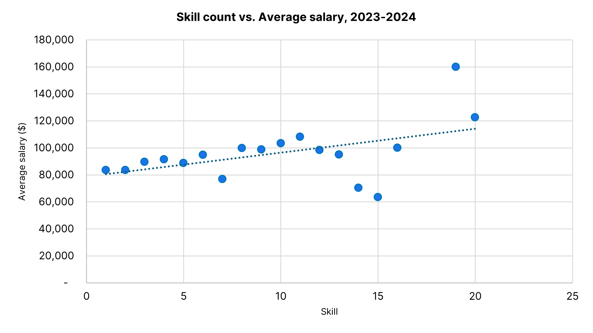

The correlation between salary and the number of skills is 0.085, indicating a relatively weak, but positive relationship. With the scatter plot, this can be seen through the moderate slope of the trend line.

The data points primarily clustered at jobs with 1 to 11 skills, with salaries from $82,000 to $108,000. For jobs that require at least 6 skills, there is a stable correspondence in salary and number of skills but with moderate pay at under $100,000. With jobs requiring more skills, the relationship was less uniform but still generally went upwards, peaking at $108,093 at 11 skills. 

The salaries of jobs requiring 19 and 20 skills were significantly more than the others, indicating that specializing in more skills could command a higher salary, although these positions may be very rare.

## 4. Market trends

### Hiring trend

To see the hiring trend from companies, I examined the total job postings by each month in 2023 and 2024.

```sql
SELECT EXTRACT(YEAR FROM date_time) AS year,  
       EXTRACT(MONTH FROM date_time) AS month,  
       COUNT(*) AS posting_count,  
       ROUND(PERCENTILE_CONT(0.5) WITHIN GROUP (ORDER BY salary_standardized)) AS median_sal  
FROM job_postings JOIN job  
    USING (job_id)  
WHERE EXTRACT(YEAR FROM date_time) IN (2023, 2024)  
  AND job_title = 'Data Analyst'  
GROUP BY year, month  
ORDER BY year, month;
```

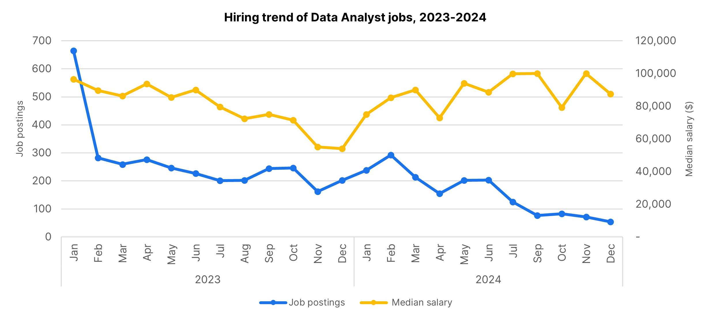

There was a clear downward trend in job postings over this period, from the peak in January 2023 at 664 to just 54 by December 2024. This suggests a cooling job market influenced by budget cuts, market saturation, or hiring freezes.

The data indicates that companies tend to post the most job openings around the first quarter, followed by a gradual decline throughout the year. This pattern repeated in 2024 with the increased hiring activity until February, a small rebound in May and June, before falling again through December.

The steep drop of postings in the end of 2024 while the median salary had an upwards direction suggests that companies were shifting toward hiring specialized or high-seniority roles (senior, lead etc.). 

In such a cooling market, competition is likely tougher and applicants are expected to differentiate themselves through high-demand skills and specializations that align with current demands. From prior findings, having specialized skills could help greatly with job finding success.

### Work-from-home trend

```sql
SELECT DISTINCT EXTRACT(YEAR FROM date_time) AS year,  
                EXTRACT(MONTH FROM date_time) AS month,  
                COUNT(*) FILTER (WHERE work_from_home = TRUE) AS wfh,  
                COUNT(*) FILTER (WHERE work_from_home = FALSE) AS non_wfh  
FROM job_postings JOIN job  
    USING (job_id)  
WHERE EXTRACT(YEAR FROM date_time) IN (2023, 2024)  
  AND job_title = 'Data Analyst'  
GROUP BY year, month  
ORDER BY year, month;
```

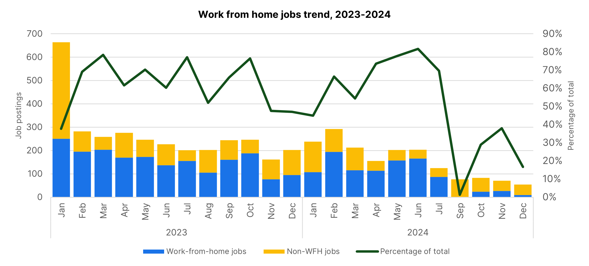

The percentage of work-from-home jobs fluctuated greatly, varying from 1.83% to 81.8% with no apparent trend. On average, the number of work-from-home jobs accounted for 62% of total job postings in 2023 and 50.3% in 2024, showing a general trend of 'return-to-office' policies in the U.S.

## 5. Job

### Highest-paid Data Analyst titles

```sql
SELECT title,  
       ROUND(salary_standardized, 1) AS salary  
FROM job_postings JOIN job  
    USING (job_id)  
WHERE job_title = 'Data Analyst'  
  AND EXTRACT(YEAR FROM date_time) IN (2023, 2024)  
ORDER BY salary DESC  
LIMIT 10;
```
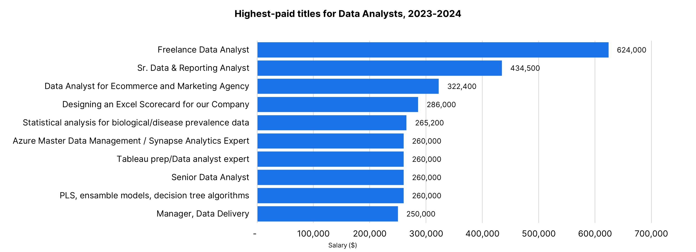

There were 4,924 data analyst job postings in 2023 and 2024, representing over 70% of the total, showing high demand for the role in the job market.

The highest paid roles in data analytics span from e-commerce to marketing, biology, cloud management, etc., illustrating growth opportunities across a wide variety of industries and professions. Notably, freelance work was paid quite competitively, showing growth potential for commission-based work.

In this pay grade, the most common job levels include seniors, managers and experts. Aligning with our findings regarding skills, a high specialization in areas of engineering and development would open new doors for higher pay. 

### Job level distribution

```sql
SELECT job_level,  
       COUNT(*) AS count  
FROM job_postings JOIN job  
    USING (job_id)  
WHERE EXTRACT(YEAR FROM date_time) IN (2023, 2024)  
  AND job_title = 'Data Analyst'  
  AND job_level IS NOT NULL  
GROUP BY job_level  
ORDER BY count DESC;
```


Among the postings that specified a job level, Senior emerged as the leading role, accounting for over 70% of the total. Lead and Intern followed, each appearing in over 90 listings.

This clear dominance of senior roles shows the market preference for specialized roles that require experience and expertise. This could limit job opportunities for recent graduates or people seeking entry-level roles.

### Salary by job level

```sql
SELECT job_level,  
       ROUND(PERCENTILE_CONT(0.5) WITHIN GROUP (ORDER BY salary_standardized)) AS median_sal  
FROM job_postings JOIN job  
    USING (job_id)  
WHERE job_level IS NOT NULL  
  AND job_title = 'Data Analyst'  
  AND EXTRACT(YEAR FROM date_time) IN (2023, 2024)  
GROUP BY job_level  
ORDER BY median_sal DESC;
```

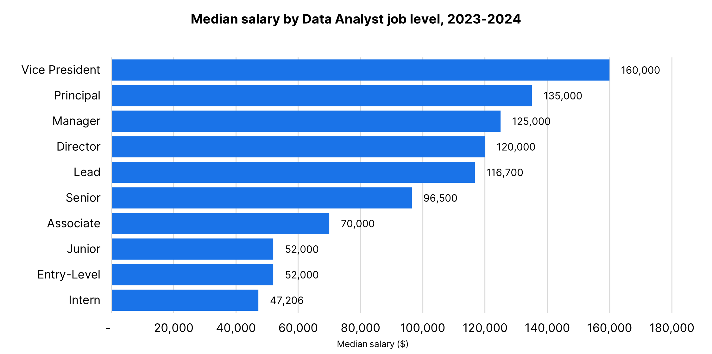

Overall, the average pay grade for roles has a very clear progression as the job level increases. 
Entry-level positions fall into the most common salary range ($15,080-$102,069) for data analysts, as previously analyzed in the salary section. 

With leadership roles such as senior, manager, and director, a big shift in pay emerged, particularly a 38% median salary increase from Associate to Senior. Among the higher-paid roles, we can see a more gradual progression from Lead to Principal. Vice President was the most well-paid at $160,000, but this role accounted for less than 1% of the total data analyst postings in 2023 and 2024.

### Most demanded skills for entry-level jobs

For people looking to enter the data analysis field, I want to find out the most requested skills for entry-level jobs. Among the roles of the job postings, I will focus on these four: Intern, Associate, Entry-level and Junior.

```sql
WITH da AS (  
           SELECT *  
           FROM job_postings JOIN job  
               USING (job_id)  
           WHERE job_title = 'Data Analyst'  
             AND job_level IN ('Intern', 'Entry-Level', 'Associate', 'Junior')  
             AND EXTRACT(YEAR FROM date_time) IN (2023, 2024)  
           ORDER BY posting_id)  
  
SELECT skill_name,  
       COUNT(*) AS count  
FROM da JOIN posting_skill  
    USING (posting_id) JOIN skill  
    USING (skill_id)  
GROUP BY skill_name  
ORDER BY count DESC  
LIMIT 10;
```

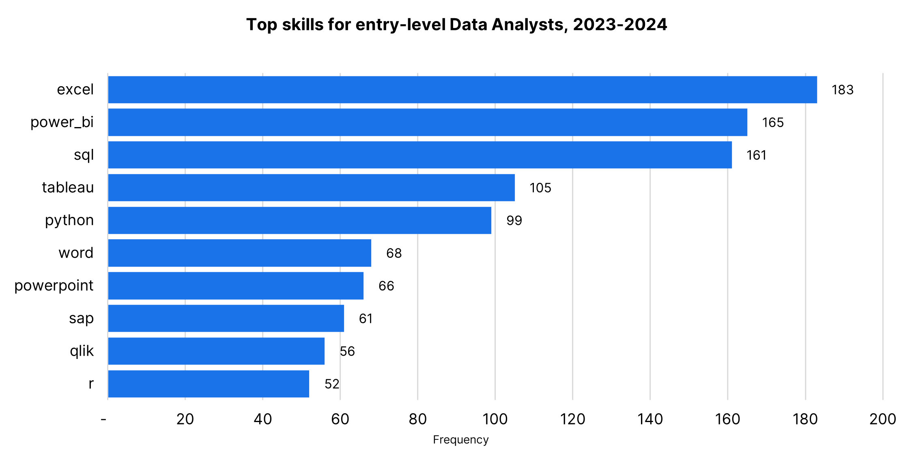

With the required skill set of entry-level roles, there are similar categories of tools from previous findings, including database, business intelligence, and office software. 

Excel was the most required tool among entry-level jobs and ranked second overall, demonstrating a strong demand in spreadsheet tools proficiency across all job levels. SQL still remains one of the most important tools for a data analyst, along with intelligence tools such as Power BI and Tableau. 

Similar to the previous analysis, programming languages including Python and R continued to be in high demand but should only be considered after the core skills. Two new notable skills emerged, Sap and Qlik, which are cloud-based business intelligence tools.

### Remote vs. on-site pay

I want to find out whether there is a difference in pay between remote jobs (where location = 'Anywhere') and on-site jobs.

```sql
--Salary for remote jobs
SELECT ROUND(salary_standardized, 2)  
FROM job_postings JOIN location  
    USING (location_id) JOIN job  
    USING (job_id)  
WHERE EXTRACT(YEAR FROM date_time) IN (2023, 2024)  
  AND job_title = 'Data Analyst'  
  AND location = 'Anywhere';

--Salary for on-site jobs
SELECT ROUND(salary_standardized, 2)  
FROM job_postings JOIN location  
    USING (location_id) JOIN job  
    USING (job_id)  
WHERE EXTRACT(YEAR FROM date_time) IN (2023, 2024)  
  AND job_title = 'Data Analyst'  
  AND location != 'Anywhere';
```

To analyze this, I propose two hypotheses to test:
- H0: Average salary remote jobs = Average salary on-site jobs
- H1: Average salary remote jobs != Average salary on-site jobs

First, we will check the skewness and kurtosis of the 2 samples to determine their distribution:
**Remote jobs:**
- Skewness = 2. Meaning the main data points are shifted strongly to the lower end.

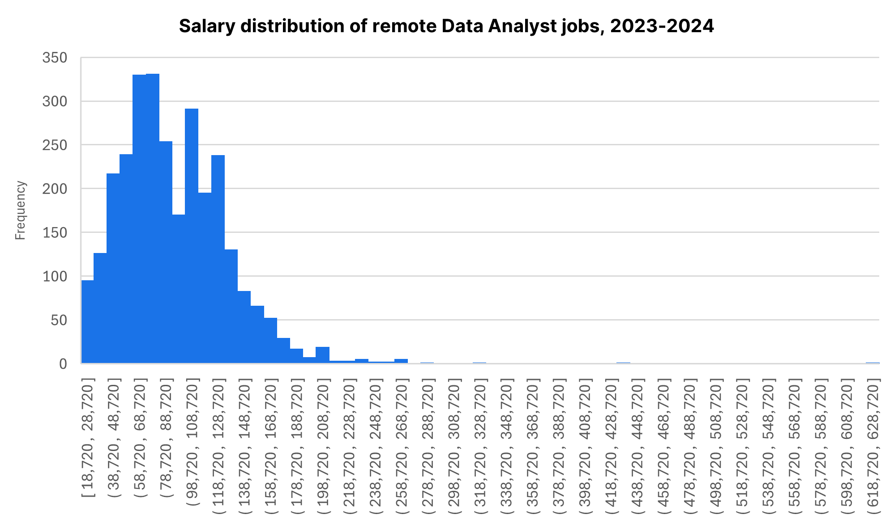

Next we formulated a probability plot to check the distribution's normality:

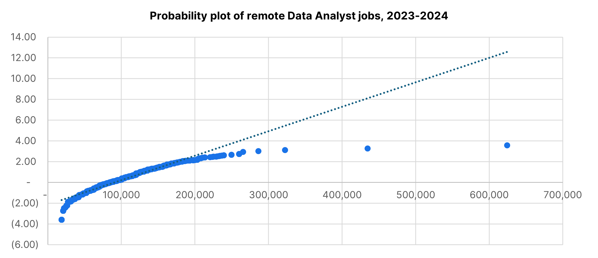

There is a clear curve downward from the trend line, indicating that the distribution is non-normal. 

**On-site jobs:**
- Skewness = 1. Meaning the main data points are shifted slightly to the lower end.

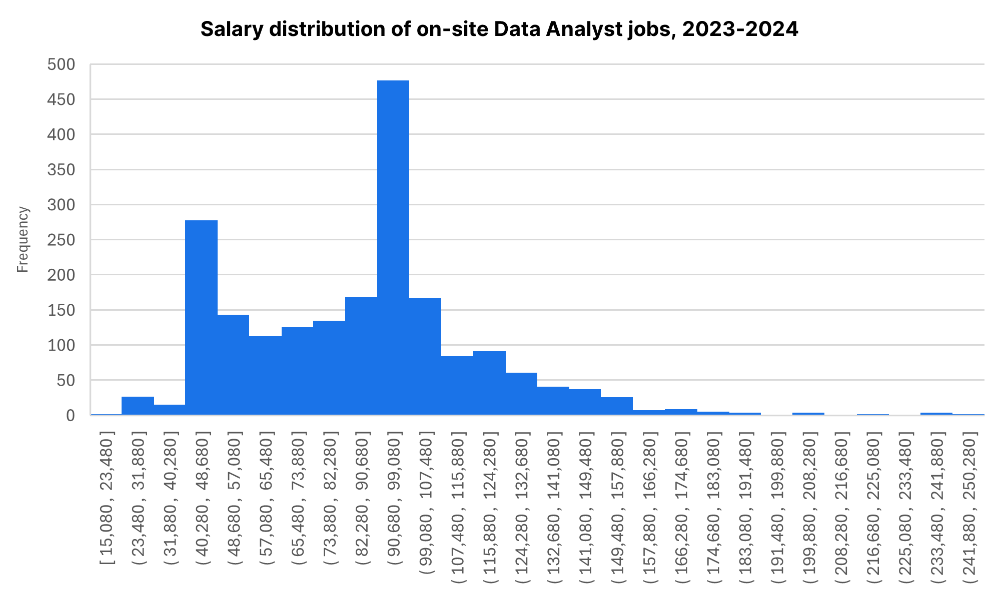

Probability plot:

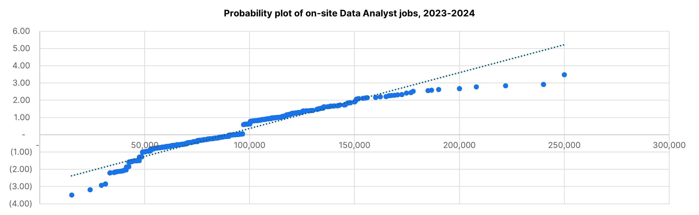

We see a similar pattern of the data points deviating away from the line, meaning the distribution is also non-normal.

For these 2 samples, I will be using the t-test to examine the hypotheses. First, I run the F-test to determine the equality of their variances with the confidence interval of 0.05:

|                     | **Remote**    | **On-site**  |
| ------------------- | ------------- | ------------ |
| Mean                | 89187.17      | 86167.47     |
| Variance            | 1709470579.98 | 920099094.10 |
| Observations        | 2913.00       | 2011.00      |
| df                  | 2912.00       | 2010.00      |
| F                   | 1.857920077   |              |
| P(F<=f) one-tail    | 0.00          |              |
| F Critical one-tail | 1.07005651    |              |

The p-value is smaller than 0.05, which means we can assume the variances are not equal. Therefore, I will proceed with the two-sample t-test with variances not assumed.

|                              | **Remote**  | **On-site** |
| ---------------------------- | ----------- | ----------- |
| Mean                         | 89187.17249 | 86167.47169 |
| Variance                     | 1709470580  | 920099094.1 |
| Observations                 | 2913        | 2011        |
| Hypothesized Mean Difference | 0           |             |
| df                           | 4904        |             |
| t Stat                       | 2.95485156  |             |
| P(T<=t) one-tail             | 0.001571538 |             |
| t Critical one-tail          | 1.645164406 |             |
| P(T<=t) two-tail             | 0.003143076 |             |
| t Critical two-tail          | 1.960447844 |             |

The p-value = 0.003 < 0.05.  Therefore, we reject the null hypothesis. 

There is a statistically significant difference in the salary between remote and on-site employees, in which remote workers earn more on average.

## 6. Company

### Top hiring companies

```sql
SELECT company_name,  
       COUNT(*) AS count  
FROM job_postings JOIN company  
    USING (company_id) JOIN job  
    USING (job_id)  
WHERE job_title = 'Data Analyst'  
  AND EXTRACT(YEAR FROM date_time) IN (2023, 2024)  
GROUP BY company_name  
ORDER BY count DESC  
LIMIT 10;
```

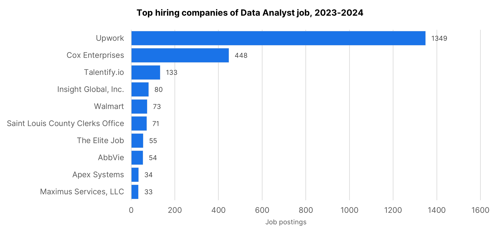

In total, 1,283 companies posted data analyst positions in 2023 and 2024, showing a demand for data analysis and management across different sectors. In particular, some notable sectors and companies include:
- **Staffing & recruitment:** Insight Global, Inc., Apex Systems, Upwork, Talentify, The Elite Job
- **Government:** Saint Louis County Clerks Office, Maximus Services, LLC.
- **Pharmaceuticals:** AbbVie
- **Retail:** Walmart
- **Communications and media:** Cox Enterprises

Upwork had the highest number of postings at 1,349. Given that Upwork is a freelancing platform, this indicates that contract-based or commissioned data analysis work was the most popular method of hiring in the field.

### Median salary by company

To understand how much companies are paying, I analyzed the distribution of companies' median salaries and identified the highest-paying companies and their respective industries.

```sql
--Median salary distribution
SELECT company_name,  
       PERCENTILE_CONT(0.5) WITHIN GROUP (ORDER BY salary_standardized) AS median_sal 
FROM job_postings JOIN company  
    USING (company_id) JOIN job  
    USING (job_id)  
WHERE job_title = 'Data Analyst'  
  AND EXTRACT(YEAR FROM date_time) IN (2023, 2024)  
GROUP BY company_name  
ORDER BY median_sal DESC;
```

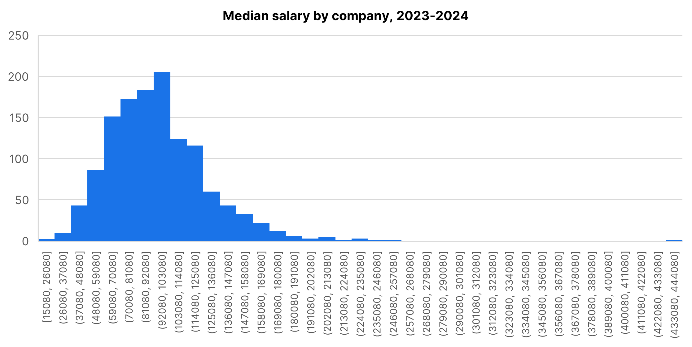

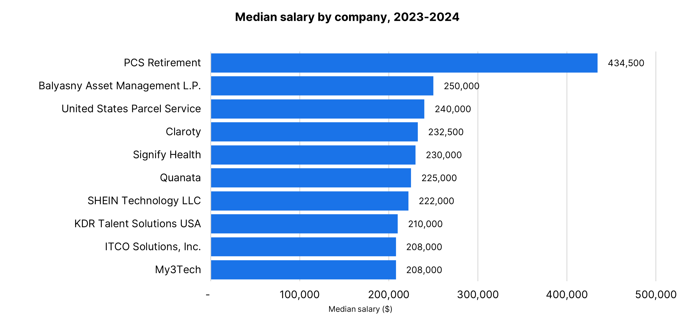

The median salaries showed a right-skewed pattern with a skewness of 1.54, which can be seen in the histogram, where the data points clustered to the lower end. Overall, the most popular median salary range falls between $70,000 and $103,000, which aligns with our findings in salary distribution.

Among the highest-paying companies, there were 2 main sectors:
- **Staffing and recruitment:** KDR Talent Solutions, ITCO Solutions, My3Tech.
- **Finance:** PCS Retirement, Balyasny Asset Management, Quanata.
Other companies are in healthcare, logistics, IT, and retail. In general, the finance sector led in compensation, with the top two roles at $434,500 and $250,000. 

### Preferred platforms of companies

In order to see platform preferences of the top hiring companies, I extracted the two most frequently used platforms by the four most active employers in 2023 and 2024.

```sql
WITH top_platform  
         AS  
         (  
         SELECT company_name,  
                platform_name,                
                COUNT(*) AS count,  
                ROW_NUMBER() OVER (PARTITION BY company_name ORDER BY COUNT(*) DESC) AS rank  
         FROM job_postings JOIN company  
             USING (company_id) JOIN platform  
             USING (platform_id) JOIN job  
             USING (job_id)  
         WHERE job_title = 'Data Analyst'  
           AND EXTRACT(YEAR FROM date_time) IN (2023, 2024)  
           AND company_name IN ('Upwork', 'Cox Enterprises', 'Talentify.io', 'Insight Global, Inc.', 'Walmart')  
         GROUP BY company_name, platform_name  
         ORDER BY company_name, count DESC)  
  
SELECT company_name,  
       platform_name,       
       count  
FROM top_platform  
WHERE rank < 3;
```

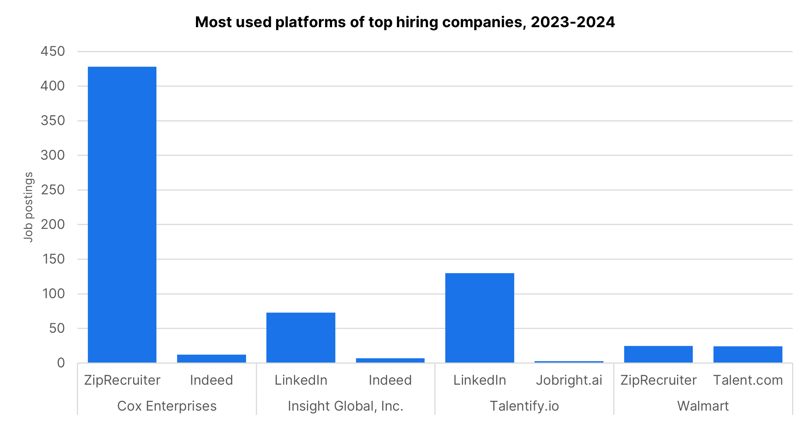

Upwork was excluded from this analysis due to its nature as a freelance marketplace where all the job postings were directly on their website. This makes cross-platform comparison irrelevant.

LinkedIn and ZipRecruiter were the main hiring platforms with the highest posting volume among the top companies. ZipRecruiter is the most favored platform for Cox Enterprises, accounting for over 95% of their postings in 2023 and 2024. Conversely, Insight Global and Talentify rely heavily on LinkedIn for their job recruitment, hosting over 90% of their total postings on the platform. Indeed was also a popular choice for Cox and Insight Global, even though posting volume was significantly lower.

### Most remote-friendly companies

Among the job postings of companies, I want to find the ones that offer the highest number of remote positions.

```sql
SELECT company_name,  
       COUNT(*) FILTER (WHERE location = 'Anywhere') AS remote_job,  
       COUNT(*) FILTER (WHERE location != 'Anywhere') AS onsite_job  
FROM job_postings JOIN job  
    USING (job_id) JOIN company  
    USING (company_id) JOIN location  
    USING (location_id)  
WHERE EXTRACT(YEAR FROM date_time) IN (2023, 2024)  
  AND job_title = 'Data Analyst'  
GROUP BY company_name  
ORDER BY remote_job DESC  
LIMIT 10;
```

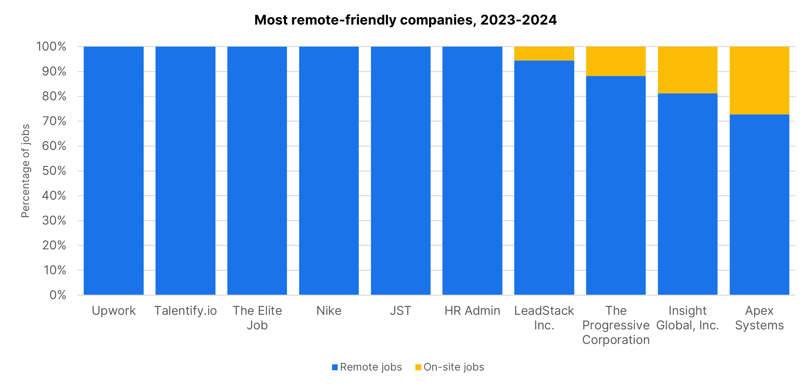

Excluding Upwork, a freelance platform where work is mainly commissioned online, there are 5 other companies that exclusively posted remote data analyst jobs in 2023 and 2024. Among the companies, the main industries are staffing/recruitment and consulting, showing a high implementation of remote work in these sectors. On the other hand, some industries that continue to prioritize in-office work include retail, services, human resources, and government.

## 7. Platform
### Most popular platforms

```sql
SELECT platform_name,  
       COUNT(*) AS count  
FROM job_postings JOIN platform  
    USING (platform_id) JOIN job  
    USING (job_id)  
WHERE job_title = 'Data Analyst'  
  AND EXTRACT(YEAR FROM date_time) IN (2023, 2024)  
GROUP BY platform_name  
ORDER BY count DESC  
LIMIT 10;
```

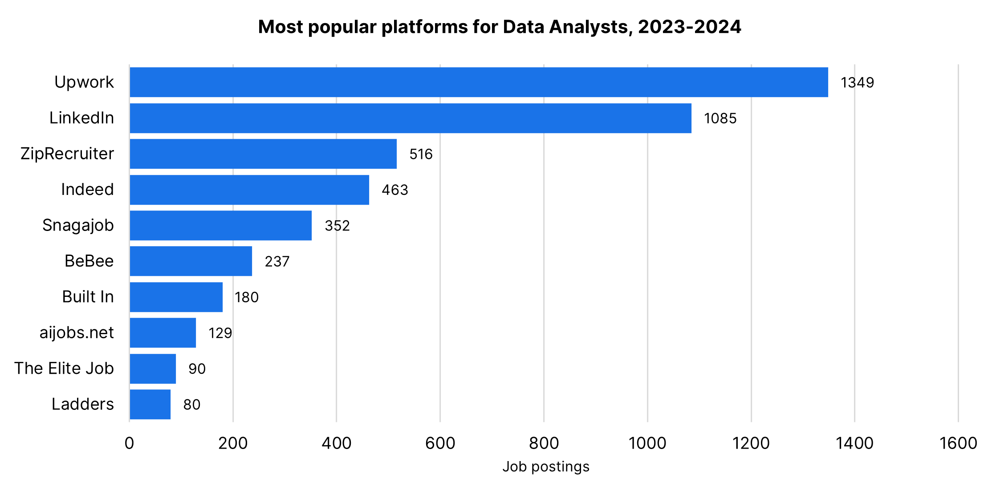

Consistent with earlier findings in top hiring companies, Upwork was the most preferred platform in 2023 and 2024. Among the 4,481 postings from the top 10 platforms, Upwork and LinkedIn accounted for over 54% of the total, highlighting their dominance in the data analyst position market. 
Other platforms such as Indeed, ZipRecruiter, and Built In also displayed strong hiring activity in the period.

### Salary distribution by platform

Following up on the most popular platforms, I want to find out the salary distribution of them to see which ones offer the most attractive pay. 

```sql
SELECT platform_name,  
       salary_standardized
FROM job_postings JOIN platform  
    USING (platform_id) JOIN job  
    USING (job_id)  
WHERE job_title = 'Data Analyst'  
  AND platform_name IN  
      ('Upwork', 'LinkedIn', 'ZipRecruiter', 'Indeed', 'Snagajob', 'BeBee', 'Built In', 'aijobs.net', 'The Elite Job',  
       'Ladders')  
  AND EXTRACT(YEAR FROM date_time) IN (2023, 2024)  
ORDER BY platform_name, salary_standardized DESC;
```

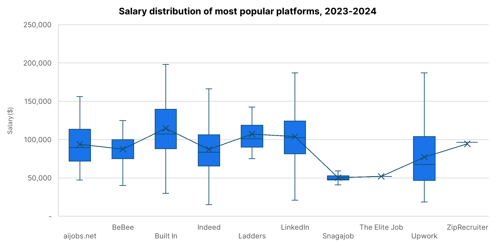

From the salary distributions of the platforms, Built In, LinkedIn, and Ladders offered the highest median salaries at $107,275, $102,440, and $101,014 respectively. At the lower end were Snagajob and The Elite Job. However, there was very little variation in the salary of The Elite Job, likely due to multiple postings offering the same salary, potentially for multiple similar positions.

Examining the interquartile ranges, Built In and Upwork showed the highest variation in salaries, with Built In from ~$88,000 to $139,000 and Upwork from $46,000 to $104,000. Meanwhile, Ladders and BeBee seem to offer more consistent pay that is centered around their median values.

The high median salaries and upper quartile figures reaching $200,000 from Built In and LinkedIn may indicate that they offered more specialized and senior roles. On the other hand, other platforms likely focused more on entry-level jobs with a lower general pay and more disparity.

### Hiring trend by platform

After seeing the distribution of these platforms, I want to dig deeper and see which platforms were the most active during certain times of the year.

```sql
SELECT DISTINCT EXTRACT(YEAR FROM date_time) AS year,  
                EXTRACT(MONTH FROM date_time) AS month,  
                COUNT(*) FILTER (WHERE platform_name = 'Upwork') AS upwork,  
                COUNT(*) FILTER (WHERE platform_name = 'LinkedIn') AS linkedin,  
                COUNT(*) FILTER (WHERE platform_name = 'ZipRecruiter') AS ZipRecruiter,  
                COUNT(*) FILTER (WHERE platform_name = 'Indeed') AS Indeed  
FROM job_postings JOIN job  
    USING (job_id) JOIN platform  
    USING (platform_id)
WHERE job_title = 'Data Analyst'  
  AND EXTRACT(YEAR FROM date_time) IN (2023, 2024)  
GROUP BY year, month  
ORDER BY year, month;
```

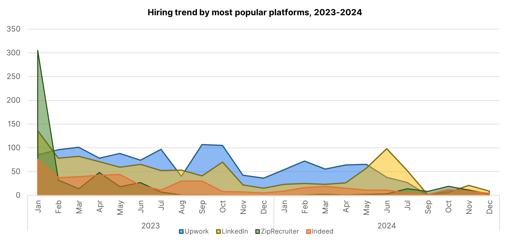

This part analyzes the 4 platforms with the highest total job postings in 2023 and 2024: Upwork, LinkedIn, ZipRecruiter, and Indeed. Overall, job recruitment activity among the platforms was significantly higher in 2023 than 2024, which had a clear trend downwards. Most postings occurred between January and April, after which they started to slow down.

- Upwork: Started strong in 2023, fluctuated mid-year, then reached its peak in September and October and declined vastly through December. General downward trend in 2024, reaching the lowest in December with 3 postings.
- LinkedIn: Began high in January and gradually declined for the rest of the year, except for a sudden spike in October to 70 postings. Similar trend in 2024 with a sharp increase in June to 98.
- ZipRecruiter: Missing data for the last 5 months of 2023, generally was active from January to April. Missing data in 2024, rendering it unfit for analysis.
- Indeed: Displayed a clear decline from January to December 2023, peaked at 76 in January. Data might be incomplete in 2024 for detailed analysis, but the first quarter still showed the highest activity, like others.

Overall, most platforms peaked in the first quarter, followed by reduced activity.  

### Best platform for remote jobs

```sql
SELECT platform_name,  
       COUNT(*) FILTER (WHERE location = 'Anywhere') AS remote,  
       COUNT(*) FILTER (WHERE location != 'Anywhere') AS onsite  
FROM job_postings JOIN job  
    USING (job_id) JOIN platform  
    USING (platform_id) JOIN location  
    USING (location_id)  
WHERE job_title = 'Data Analyst'  
  AND EXTRACT(YEAR FROM date_time) IN (2023, 2024)  
GROUP BY platform_name  
ORDER BY remote DESC, onsite DESC  
LIMIT 10;
```

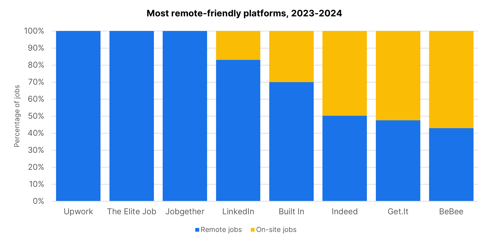

The top three platforms for remote data analyst jobs in 2023 and 2024 include Upwork, The Elite Job, and Jobgether, with 100% of postings listed as remote. With Upwork, this is consistent with its nature as a freelance platform that primarily offers work remotely. LinkedIn and Built In were fantastic platforms for remote job seekers, with over 70% of postings in 2023 and 2024 labeled remote. Indeed, Get.it, and BeBee were also great contenders, although their remote jobs are significantly lower than the others. 

## 8. Location
### Most popular job locations

Since all the job postings are in the US, this is to see the top states/cities among the postings.

```sql
SELECT state,  
       COUNT(*) AS count  
FROM job_postings JOIN location  
    USING (location_id) JOIN job  
    USING (job_id)  
WHERE job_title = 'Data Analyst'  
  AND EXTRACT(YEAR FROM date_time) IN (2023, 2024)  
  AND state IS NOT NULL  
GROUP BY state  
ORDER BY count DESC;
```

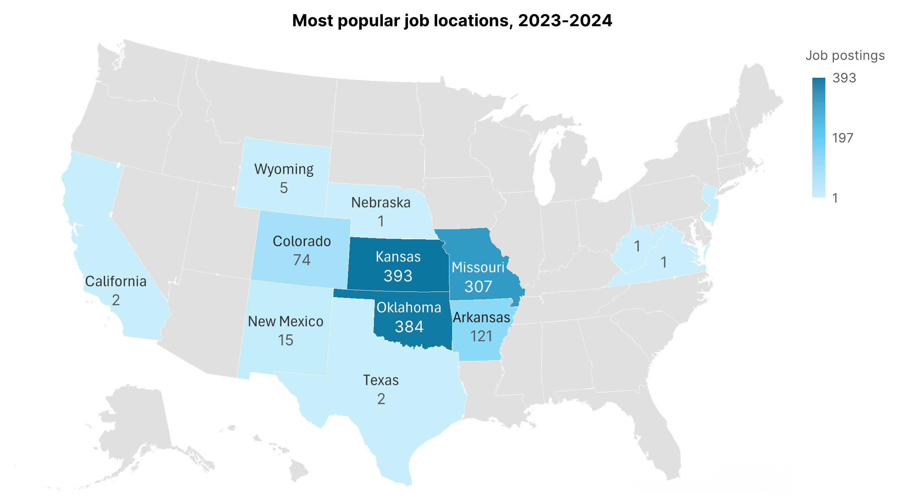

In total, 13 states were represented in data analyst postings in 2023 and 2024. There was a significant disparity in the number of job postings across the states. From the extracted data, the standard deviation is 154.1, the average is 100.6 and the median is 5, indicating certain states had a disproportionately high number of postings.

Kansas, Oklahoma, and Missouri were the main job hubs for data analyst jobs, with significantly higher posting volume compared to other states. In particular, the most active cities of these states include:
- Kansas: Wichita (65), Topeka (29), Maize (27)
- Oklahoma: Oklahoma City (91), Tulsa (54), Edmond (20)
- Missouri: Jefferson City (97), Kansas City (84), California (31)

The figures suggest that the Midwest and South Central were key regions for data analyst recruitment in this period.  

### Median salary by state

```sql
SELECT state,  
       PERCENTILE_CONT(0.5) WITHIN GROUP (ORDER BY salary_standardized) AS median_sal 
FROM job_postings JOIN location  
    USING (location_id) JOIN job  
    USING (job_id)  
WHERE job_title = 'Data Analyst'  
  AND EXTRACT(YEAR FROM date_time) IN (2023, 2024)  
  AND state IS NOT NULL  
GROUP BY state  
ORDER BY median_sal DESC;
```

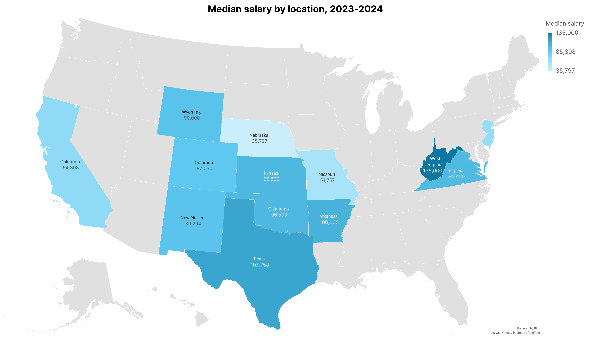

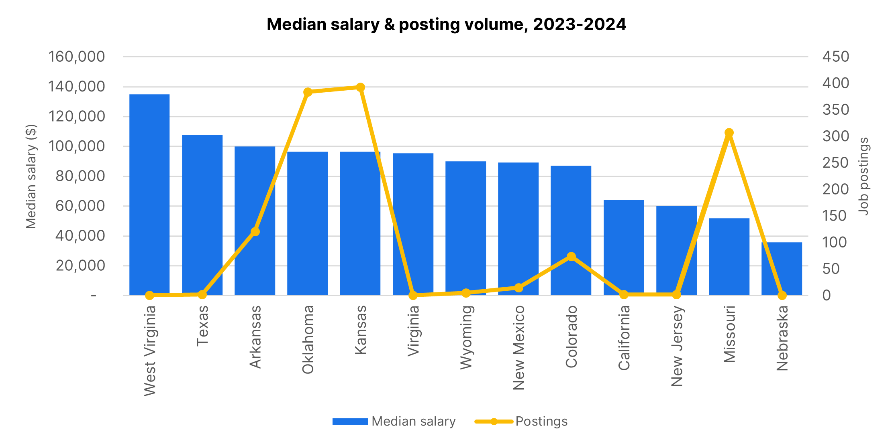

From the median salaries across the 13 states, there is a disparity in pay indicated by a standard deviation of $26,183 and a median of $90,000. West Virginia reported the highest median pay of $135,000, and Nebraska the lowest at $35,797. However, these two states only had one posting, so the figures are not representative of their regional pay level.

Among the three states with the most postings, Oklahoma and Kansas offered salaries above the median value at $96,500, whereas Missouri had a significantly lower pay at only $51,757. Oklahoma and Kansas may be the most ideal locations for data analyst job seekers as they offer competitive salaries and high volume of recruitment opportunities.

Other relatively high-paying states include Arkansas, Colorado and Texas, but they offer much fewer job opportunities. In general, there seems to be no correlation between the number of postings and the median pay levels of a region.

### Job level by state

```sql
SELECT state,  
       job_level,       
       COUNT(*) AS count  
FROM job_postings JOIN location  
    USING (location_id) JOIN job  
    USING (job_id)  
WHERE job_title = 'Data Analyst'  
  AND EXTRACT(YEAR FROM date_time) IN (2023, 2024)  
  AND state IS NOT NULL  
  AND job_level IS NOT NULL  
GROUP BY state, job_level  
ORDER BY state, count DESC;
```

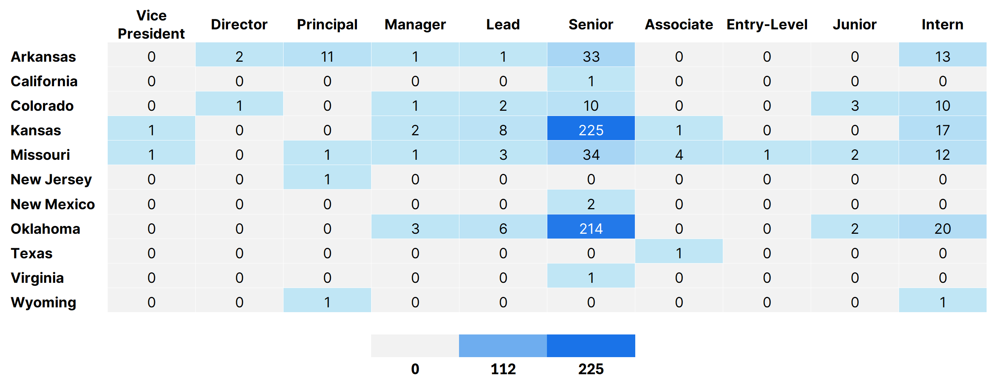

Among the higher job levels, including Lead, Manager, Principal, Director, and Vice President, the postings were very scarce and scattered across different states with no concentration. 

Oklahoma and Kansas, which had the highest recruitment activity in 2023 and 2024, were mainly hiring senior roles, accounting for 87.3% and 88.5% of their total postings respectively. Arkansas also had a relatively high portion of senior hires. Examining the companies that posted in these states, the main industries are healthcare & pharmaceuticals, IT & software, staffing and retail. These industries likely required more experienced and specialized data analysts.

Intern was the second most posted title behind senior, concentrating mainly in Oklahoma, Kansas and Arkansas. Therefore, these could be the main hubs for data analysts seeking internship opportunities.


# Conclusions

After analyzing different aspects of the data analyst postings in 2023 and 2024, some great insights include:

**Salary:** 
- Data Analyst salary ranges from $15,000 to $624,000, presenting great earning potential for aspiring newcomers.
- The highest paid data analyst titles concentrate in e-commerce, marketing, and cloud management/engineering.
- In general, remote jobs pay slightly higher than on-site jobs.

**Skill:**
- The most in-demand skills for data analysts include SQL, Excel, Tableau and Power BI, and Python. This indicates the main skill set for data analysts generally include database management, office tools, business intelligence and programming.
- The highest-paid skills fall into cloud infrastructure, software and web development, and specialized analytics tools (ggplot, scikit-learn).
- For newcomers or people looking to enter data analytics, the most common skills among entry-level roles include Excel, Power BI, and SQL.
**⇒ SQL and Excel emerge as the most required skills across all job levels**

**Job:**
- Senior was the most hired position among the data analyst postings in 2023 and 2024, making up 70% of all job levels.
- For on-site senior and intern roles, the main job hubs were Kansas and Oklahoma.
- Clear progression of median salary across job levels. Entry-level roles salaries range from $47,000 to $70,000, presenting great pay for newcomers.

**Company:**
- Among the most active companies in 2023 and 2024, staffing and government were the dominant sectors.
- The most popular pay grade among the companies was $70,000 to $103,000.
- The highest-paying companies fall into finance, staffing, healthcare and IT segments.
- For remote workers, the most remote-friendly companies include Talentify, Nike, The Progressive Corp. and Apex Systems, with almost all jobs posted in 2023 and 2024 listed as remote.

**Platform:**
- The most used platforms for recruitment were Upwork, LinkedIn, ZipRecruiter, and Indeed.
- For remote work seekers, Upwork, The Elite Job and Jobgether were the best platforms, offering exclusively remote jobs.

**Location:**
- The main job hubs for data analysts were Kansas and Oklahoma, both offering high job opportunities and attractive pay.

# Recommendations

## For entry-level positions

- **Focus on essential skills:** The findings show that the market consistently demands candidates with strong Excel and SQL skills.
- **Business Intelligence tools:** Proficiency in business intelligence tools are highly required, specifically Tableau and Power BI.
- **Programming can give an edge:** Learning programming languages such as Python and R can be valuable, but not strictly required at this level.
- **Have realistic pay expectations:** Median salary of these levels often fall between $40,000 to $70,000. Candidates should focus more on gaining experience first instead of securing a good pay.
- **Key locations:** For this job level, Oklahoma, Kansas, Missouri, and Arkansas are locations that offer high job opportunities and competitive pay.

**⇒ Since applicants of these positions often lack experience, building a strong portfolio that can demonstrate your skills is key to landing a job.**

## For remote workers

- **Target remote-centric platforms and companies:** From the data, the most remote-friendly industries are staffing and consulting, and the best platforms for remote jobs are Upwork, The Elite Job and Jobgether.
- **Leverage the higher pay of remote work:** The average pay of remote jobs appear to be slightly higher than on-site ones, candidates can use this insight during salary negotiations.

# Lessons

Through this project I got to apply my SQL knowledge into multiple purposes from cleaning a dataset, normalizing tables, and querying exact information for analysis. Some of the techniques used in this have helped solidify my understanding and familiarity with SQL such as common table expressions (CTE), subqueries, window functions, multiple joins, working with text data type, etc.

Visualizing the extracted data with Excel has also helped me understand many chart best practices such as choosing the most suitable chart for each type of data, making a chart visually understandable, ensuring fonts and colors used are easy on the eyes, etc.

For future development, this project can be expanded to cover many more data roles such as data engineering, data scientist, business analyst, etc. to discover valuable insights in their respective fields.
